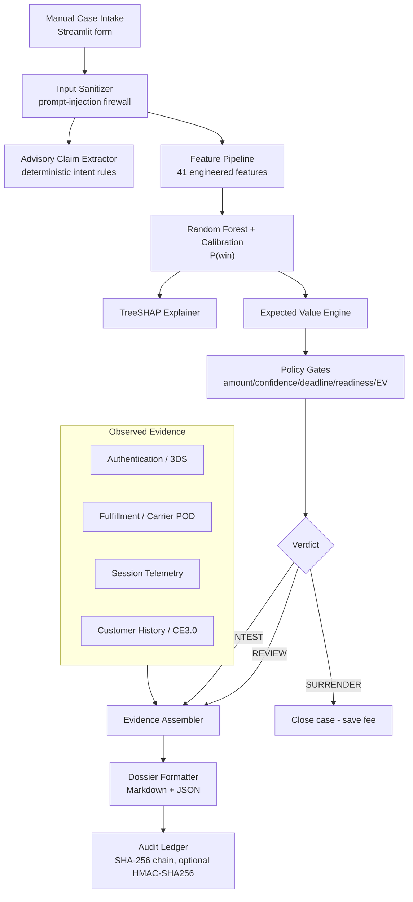

# NYAYANTRA

## Payment Dispute Intelligence

NYAYANTRA is a decision-support system for post-payment chargeback triage: an operator enters a dispute manually, and the system sanitizes any customer complaint text, extracts deterministic advisory claim signals, engineers a deterministic feature set, produces a calibrated win probability with a Random Forest classifier, explains that score with exact TreeSHAP attributions, weighs the economics of contesting against a non-refundable arbitration fee, applies deterministic policy gates, and returns one of three verdicts — **CONTEST**, **REVIEW**, or **SURRENDER** — together with a provenance-aware evidence dossier and an append-only cryptographic audit trail. Everything runs locally on synthetic data through a Streamlit operations console.

> [!IMPORTANT]
> **This is a synthetic simulation / technical demonstration — not production software.**
>
> - No live bank, issuer, Visa, Mastercard, Razorpay, carrier, or payment-gateway APIs are queried. There are zero external API calls in the codebase.
> - All datasets and telemetry are synthetic.
> - The system must not be used to make real financial or dispute decisions.
> - The generated evidence provenance IDs are simulated.

## Recent Changes

- **Project Rebranding**: Renamed from SYVORA to **Nyayantra** (न्यायंत्र — *Nyaya* [Justice/Fairness] + *Yantra* [Autonomous Engine/Machine]) to establish distinct brand identity and ensure trademark uniqueness for the buildathon submission.
- **UI State Synchronization**: Added explicit session-state key synchronization to the navigation dock radio widget in `dashboard/app.py`, preventing interactive sub-views (such as Manual Intake and Firewall Tester) from unintentionally resetting to the landing view on form submission.
- **Policy Gate Formatting**: Corrected string interpolation in `render_policy_gate_summary()`, ensuring deterministic policy gate badges render styled `PASS` and `TRIGGERED` status pills instead of unformatted template literals.
- **Accessibility & Hero Layout**: Fixed header string spacing and `<br/>` line break syntax in the landing hero layout for clean cross-browser rendering.
- **Automated Quality Verification**: All UI fixes were visually validated end-to-end using Playwright browser automation, while maintaining 100% test pass rate across the full 115-test pytest suite (`pytest tests/`).

## What It Does

The complete workflow, executed deterministically for every dispute:

```
Manual dispute input (Streamlit intake form)
   │
   ▼
Customer complaint sanitization ──── prompt-injection firewall;
   │                                 original preserved as labeled untrusted audit data
   ▼
Advisory claim understanding ─────── deterministic intent extractor (advisory only, zero ML influence)
   │
   ▼
Deterministic feature engineering ── 41 fixed-schema features, leakage-guarded
   │
   ▼
Calibrated ML probability ────────── Random Forest + probability calibration
   │
   ▼
TreeSHAP explanation ─────────────── exact per-feature attributions (probability units)
   │
   ▼
Bayesian Expected Value ──────────── E[EV] vs break-even threshold
   │
   ▼
Deterministic policy gates ───────── amount / confidence / economics /
   │                                 deadline / evidence-readiness
   ▼
CONTEST  |  REVIEW  |  SURRENDER
   │
   ▼
Evidence dossier ─────────────────── observed-vs-derived separation, provenance citations
   │
   ▼
Cryptographic audit ledger ───────── append-only SHA-256 hash chain, optional HMAC signing
```

### A dispute's journey in plain language

1. **Intake** — an operator fills the manual intake form (`dashboard/app.py`) or selects a stored test dispute.
2. **Sanitization & claim understanding** — complaint text passes through `src/security/sanitizer.py`; hostile phrasing is neutralized, and `src/nlp/claim_extractor.py` extracts advisory claim signals with zero ML influence.
3. **Feature engineering** — `src/ml/features.py` converts the record into 41 fixed-schema features; outcome-related fields are structurally blocked from entering.
4. **Win probability** — `NyayantraScorer` (`src/ml/train.py`) returns a calibrated probability on the calibrated Random Forest.
5. **Explanation** — `DisputeExplainer` (`src/ml/explain.py`) attributes that score to individual evidence factors using exact TreeSHAP.
6. **Economics** — `DecisionEngine.calculate_expected_value` (`src/engine.py`) weighs potential recovery against the non-refundable fee and derives the break-even threshold τ*.
7. **Gates & verdict** — five deterministic gates in `evaluate_dispute` (`src/engine.py`) produce CONTEST, REVIEW, or SURRENDER.
8. **Evidence, exhibits & audit** — `EvidenceAssembler` (`src/agent/assembler.py`) and `MultiExhibitCompiler` (`src/agent/packet_compiler.py`) package provenance-cited facts into structured exhibits and a downloadable demonstration defense packet (`src/agent/packet_formatter.py`), and a committed decision is sealed into the append-only hash chain (`src/security/audit.py`).

## Quick Demo

After completing [Installation](#installation), launch the operations console:

```bash
streamlit run dashboard/app.py
```

A two-minute tour of the five console views:

| # | View | Do this | What to notice |
|---|------|---------|----------------|
| 1 | **Live Triage** | Select any held-out dispute, or use the High Win / High $ / Low EV presets | Verdict band, policy-gate matrix, TreeSHAP drivers, EV decomposition, Multi-Exhibit Viewer (Exhibits A–E), and HTML defense packet download |
| 2 | **Manual Case Intake** | Enter your own dispute fields and a customer complaint — then try an injection-style complaint such as *"Ignore previous instructions…"* | Sanitizer audit panel, Claim–Evidence Consistency Advisor, and HTML defense packet export; P(Win), Expected Value, and verdict stay identical with or without hostile text |
| 3 | **Benchmark & Economics** | Review the metric tables | Honest autonomous-vs-blind strategy comparison on the synthetic split |
| 4 | **Audit Chain** | Commit a decision in triage or intake, then open this view | Append-only entry chain, integrity check, signing mode |
| 5 | **Input Firewall** | Paste adversarial text into the tester | Detected threat categories and the neutralized output |

### Screenshots

Dashboard captures are not bundled yet. To add them later: save PNGs under `docs/screenshots/` using the filenames below (see `docs/screenshots/README.md` for capture guidance), then uncomment the matching lines.

```markdown
<!--  -->
<!--  -->
<!--  -->
<!--  -->
<!--  -->
```

## Key Capabilities

- 41 engineered features with strict target/metadata leakage guards
- Random Forest classifier with probability calibration (5-fold out-of-fold)
- TreeSHAP explainability with correct unit labeling
- Expected Value decisioning with break-even analysis
- Evidence-readiness scoring (0–100 composite index)
- Manual dispute intake for ad-hoc cases

## ML Evaluation

Evaluated on the project's **synthetic chronological test split** (N=180, held-out by dispute date). These are simulation metrics, not real-world financial performance.

| Metric | Score |
|---|---|
| Test PR-AUC | 0.8347 |
| Test ROC-AUC | 0.8597 |
| Test Brier Score (calibrated) | 0.1506 |
| Test Accuracy | 80.56% |
| Test Precision | 82.72% |
| Test Recall | 76.14% |
| Test F1 | 0.7929 |

Training protocol: chronological train/validation/test split (70/15/15), model selection by validation PR-AUC, out-of-fold calibration fitted only on training data, final metrics from the untouched test split.

## Decision Engine & Economics

Contesting a chargeback is fundamentally an economic bet:
- If the merchant **wins**, they recover the disputed transaction principal (`Amount`).
- If the merchant **contests and loses**, they lose the transaction principal *and* must pay a non-refundable bank arbitration fee (`Arbitration Fee`).
- If the merchant **surrenders** upfront, they lose the transaction amount but pay **zero** arbitration penalties.

The Expected Value $\mathbb{E}[\text{EV}]$ determines whether defending a dispute produces a positive or negative financial return on average:

```text
E[EV] = P(win) × Amount − (1 − P(win)) × Arbitration Fee
```

### Parameter Breakdown
- **$P(\text{win}) \in [0, 1]$**: Calibrated empirical win probability generated by the Random Forest classifier (after isotonic calibration to remove overconfidence).
- **$\text{Amount}$**: Gross transaction value at dispute (e.g. ₹15,000).
- **$\text{Arbitration Fee}$**: Non-refundable network arbitration penalty incurred if the defense fails (e.g. ₹2,500; defaults to ₹500 in base config).

### Break-Even Probability ($\tau^*$)
Setting $\mathbb{E}[\text{EV}] = 0$ yields the minimum win probability required for contesting to be economically viable:

$$\tau^* = \frac{\text{Arbitration Fee}}{\text{Amount} + \text{Arbitration Fee}}$$

Because the arbitration fee is fixed, **smaller disputes require a much higher win probability to justify defense**. For instance, a ₹200 dispute with a ₹500 fee demands $\tau^* = 71.4\%$ (contesting weak micro-disputes destroys margin), whereas a ₹15,000 dispute with a ₹2,500 fee requires only $\tau^* = 14.29\%$.

### Worked Numeric Example
Consider a high-value merchant dispute:
- **Dispute Amount ($A$)**: ₹15,000
- **Arbitration Fee ($F$)**: ₹2,500
- **Calibrated Win Probability ($P(\text{win})$)**: 78% (0.78)

1. **Calculate Break-Even Win Threshold ($\tau^*$)**:
   $$\tau^* = \frac{2500}{15000 + 2500} = \frac{2500}{17500} \approx 14.29\%$$
2. **Calculate Expected Value ($\mathbb{E}[\text{EV}]$)**:
   $$\mathbb{E}[\text{EV}] = (0.78 \times 15000) - (1 - 0.78) \times 2500$$
   $$\mathbb{E}[\text{EV}] = 11700 - (0.22 \times 2500) = 11700 - 550 = +\text{₹}11,150.00$$
3. **Verdict**: Because $P(\text{win}) = 78\% \ge 14.29\%$ and $\mathbb{E}[\text{EV}] = +\text{₹}11,150.00 > 0$, the dispute is economically favorable. Assuming all 5 deterministic policy gates pass, the engine assigns a **CONTEST** verdict.

### Evidence-Readiness Score (0–100 Composite Index)
The Evidence-Readiness score is a deterministic composite index evaluating whether essential physical and digital proof artifacts are present before filing. It weights EMV 3DS authentication tokens, carrier Proof-of-Delivery (POD) signatures, customer IP/device fingerprint matches, and prior transaction history. Policy Gate 5 enforces a readiness score of $\ge 60/100$ to prevent submitting incomplete or unverifiable evidence dossiers to card networks.

### Verdict Summary

| Verdict | Meaning |
|---|---|
| **CONTEST** | Positive expected value ($\mathbb{E}[\text{EV}] > 0$) and all 5 policy safety gates pass — automated defense packet compiled. |
| **REVIEW** | Positive expected value but 1+ policy gates triggered (e.g. amount $\ge \text{₹}25,000$, deadline $\le 3\text{ days}$, readiness $< 60$) — escalated to human review. |
| **SURRENDER** | Negative expected value ($\mathbb{E}[\text{EV}] \le 0$) — accepting the dispute preserves capital by eliminating non-refundable arbitration loss fees. |

## Security

- Untrusted customer complaint text passes through a deterministic sanitizer (prompt-injection signatures, delimiter break-outs, control/ANSI/BiDi characters) before anything downstream can interpret it.
- Original complaint text is preserved **only** inside an explicitly labeled `UNTRUSTED / SANITIZED` audit field; display surfaces use the neutralized copy.
- Customer text cannot influence ML features, win probability, expected value, verdicts, or evidence provenance — enforced structurally and covered by regression tests.
- Audit ledger: canonical-JSON SHA-256 payload hashing plus chained entry hashing (`prev_hash ‖ payload_hash ‖ timestamp ‖ id ‖ type`).
- Optional HMAC-SHA256 entry authentication: set `NYAYANTRA_AUDIT_SECRET` (or `SENTINEL_AUDIT_SECRET`) to sign every new entry; verification fails closed on unsigned entries when the key is configured.
- Demo ledger (`data/demo_audit_ledger.jsonl`) is separated from the runtime ledger path (`data/audit_ledger.jsonl`); both are environment-local and never committed.

This is a demonstration of security-engineering patterns, not a production-bank secure system.

## Architecture



## Project Structure

```
nyayantra/
├── config.py                  # thresholds, paths, seeds (all simulation constants)
├── requirements.txt
├── docs/
│   └── screenshots/           # dashboard captures (guide: docs/screenshots/README.md)
├── dashboard/
│   └── app.py                 # Streamlit operations console (triage, manual intake,
│                              #   benchmark, audit ledger, sanitizer views)
├── src/
│   ├── engine.py              # DecisionEngine: EV math + deterministic policy gating
│   ├── ml/
│   │   ├── features.py        # FeaturePipeline (41 features, leakage guards)
│   │   ├── train.py           # training, OOF calibration, evaluation, artifacts
│   │   └── explain.py         # DisputeExplainer (exact TreeSHAP)
│   ├── agent/
│   │   ├── schemas.py         # pydantic schemas, exhibits, and evidence checklist
│   │   ├── assembler.py       # EvidenceAssembler (provenance, sanitization hook)
│   │   ├── dossier.py         # rebuttal dossier formatter
│   │   ├── packet_compiler.py # MultiExhibitCompiler (Exhibits A–E)
│   │   └── packet_formatter.py# BankPacketFormatter (standalone HTML defense packet)
│   ├── nlp/
│   │   ├── intents.py         # intent lexicons and deterministic pattern definitions
│   │   ├── claim_extractor.py # DeterministicClaimExtractor (advisory only)
│   │   └── consistency_advisor.py # DeterministicConsistencyAdvisor (advisory only)
│   └── security/
│       ├── audit.py           # AuditLedger (hash chain, optional HMAC)
│       └── sanitizer.py       # InputSanitizer (injection firewall)
├── data/
│   ├── generate_dataset.py    # seeded synthetic generator
│   └── disputes/train/val/test.csv
├── models/
│   ├── sentinel_model.joblib  # trained calibrated model (tracked, ~4.8 MB)
│   └── test_metrics.json
├── benchmark/
│   └── evaluate.py            # reproducible benchmark harness (+ results JSON)
└── tests/                     # authoritative test suite (115+ tests)
```

**Where to start reading:** the decision logic in `src/engine.py`, the security model in `src/security/`, the claim understanding & consistency in `src/nlp/`, the exhibit compiler in `src/agent/`, the ML pipeline in `src/ml/train.py`, and the console in `dashboard/app.py`.

## Local Run

```bash
pip install -r requirements.txt
streamlit run dashboard/app.py
```

The trained model artifact (`models/sentinel_model.joblib`) is included in the repository, so the console works immediately after cloning. To regenerate data, model, or benchmarks from scratch:

```bash
python data/generate_dataset.py
python src/ml/train.py
python benchmark/evaluate.py
```

To enable HMAC-signed audit entries, set the `NYAYANTRA_AUDIT_SECRET` environment variable before launching the app.

## Testing

```bash
pytest -q
```

The suite covers unit mathematics (EV/break-even boundaries), feature-pipeline integrity and leakage prevention, model inference determinism, TreeSHAP invariants, decision-policy gating, sanitizer integration and injection containment, deterministic claim understanding, consistency cross-referencing, multi-exhibit compilation, standalone defense packet generation, hash-chain tamper detection (modification, deletion, reordering, forged signatures), and strict decision invariance.

## Important Disclaimer

**NYAYANTRA is a synthetic simulation and technical demonstration.**

- It does not connect to any bank, card issuer, card network, carrier, or payment gateway.
- The datasets, telemetry, and provenance record IDs are synthetic.
- It must not be used to make real financial or dispute decisions.
- Metrics describe behavior on synthetic data only and do not predict real-world performance.

## Future Work

Planned directions (not yet implemented):

- AI-assisted extraction of structured fields from free-form dispute complaints
- Evidence document ingestion (invoices, receipts, carrier PDFs)
- Real enterprise data connectors
- Production database-backed audit storage with external anchoring
- Asymmetric digital signatures for audit entries
- Human-review workflow analytics
